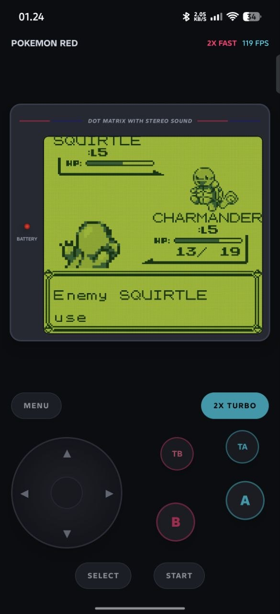
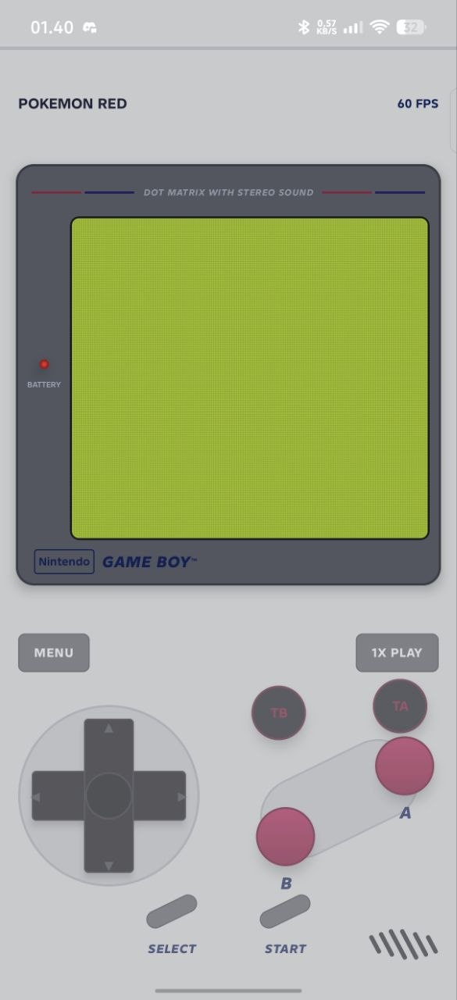

# NovaGB

NovaGB is an open-source Game Boy (DMG) and Game Boy Color (CGB) emulator for Android. The core and user interface are written in Kotlin using Jetpack Compose and Material 3. The project also includes an optional C++/NDK JNI bridge for integrating native cores such as Gambatte or SameBoy.

---

## Screenshots

<p align="center">
  
  &nbsp;&nbsp;
  
</p>

*Left: Modern dark theme with retro bezel, 2x fast-forward, and real-time FPS counter. Right: Classic DMG-01 console shell with textured buttons and speaker grille.*

---

## Features

### Core Emulation

- **Sharp LR35902 CPU**: Full emulation of the 4.194304 MHz Z80 hybrid processor, covering all primary opcodes (`0x00`-`0xFF`) and `CB`-prefixed extended instructions. Handles interrupt dispatch (V-Blank, LCD STAT, Timer, Serial, Joypad), HALT state bug reproduction, and EI instruction delay.
- **PPU Scanline Renderer**: Cycle-accurate pixel processing unit running at 160x144 resolution with double buffering. Supports background tilemaps, the window overlay layer, and up to 40 sprites (8x8 and 8x16 modes) with coordinate-based priority resolution.
- **4-Channel APU**: Stereo sound generation via 44.1 kHz PCM output using AudioTrack streaming:
  - Channel 1: Pulse wave with frequency sweep and duty cycle control.
  - Channel 2: Pulse wave with duty cycle control.
  - Channel 3: Custom 32-sample 4-bit Wave RAM playback.
  - Channel 4: Pseudo-random white noise via Linear Feedback Shift Register (LFSR).
  - High-pass IIR filter to eliminate DC bias and popping artifacts.
- **Hardware Timers**: Complete implementation of DIV, TIMA, TMA, and TAC registers, including falling-edge multiplexer behavior and delayed overflow interrupts.
- **Cartridge Memory Bank Controllers**:
  - ROM Only (up to 32 KB)
  - MBC1 (up to 2 MB ROM / 32 KB RAM, bank 0 switching quirks, RAM banking)
  - MBC2 (built-in 512x4-bit internal RAM)
  - MBC3 (up to 2 MB ROM / 32 KB RAM with latched Real-Time Clock registers)
  - MBC5 (up to 8 MB ROM / 128 KB RAM with 9-bit ROM bank addressing)
- **Save Management**: Battery-backed SRAM auto-saves (`.sav` format) and snapshot save states (`.state` format) with slot selection and timestamps.

### Interface and Display

- **Two Console Themes**:
  - **Modern Dark**: OLED-friendly dark background with electric cyan and magenta accents.
  - **Classic DMG-01**: Authentic light warm-gray ABS plastic body, textured D-pad with concave thumb rest, angled magenta A and B buttons inside a diagonal capsule recess, rubber SELECT/START pills, and a 6-slot speaker grille.
- **Retro Bezel Display**: Optional hardware-style display border with "DOT MATRIX WITH STEREO SOUND" branding, red power LED, and "GAME BOY™" lettering.
- **Color Palettes**:
  - Classic DMG (authentic pea-soup green)
  - Pocket Gray (high-contrast monochrome)
  - Game Boy Light (indiglo teal backlight)
  - Cyberpunk Neon
  - Golden Amber
- **Screen Scaling**: Original 10:9, Integer Scale (3x), Fit Screen, and Full Stretch modes with optional LCD dot-matrix grid overlay.
- **Game Library**: ROM dashboard with persistent SQLite storage, metadata extraction, search, sorting, and automatic box art fetching via the Libretro Thumbnails repository.
- **Diagnostics**: Built-in circular log buffer, crash boundary dialog, and one-tap log export to file or system clipboard.

### Controls

- **Virtual Touch Controls**:
  - 8-way directional pad with angle detection for diagonals.
  - Tactile haptic feedback on button presses via the Android vibrator service.
  - Dedicated turbo buttons (TA and TB) for automatic rapid-fire inputs.
  - Fast-forward toggle button (up to 2x speed).
  - Adjustable controller opacity and scaling.
- **Physical Gamepad Support**: Automatic mapping for Bluetooth and USB gamepads (Xbox, PlayStation DualShock/DualSense, 8BitDo, and generic HID controllers) via Android key events and joystick axes.

---

## Project Structure

```text
NovaGB/
├── app/
│   ├── src/
│   │   ├── main/
│   │   │   ├── cpp/                         # Optional C++ JNI bridge for native cores
│   │   │   ├── java/com/novagb/emulator/
│   │   │   │   ├── audio/                   # GbAudioPlayer (AudioTrack streaming)
│   │   │   │   ├── core/                    # Cpu, Mmu, Cartridge, Ppu, Apu, Joypad, Timer, GameBoy
│   │   │   │   ├── data/                    # AppSettings, RomMetadata, RomRepository, EmulatorLogger
│   │   │   │   ├── ui/
│   │   │   │   │   ├── components/          # RetroDisplay, TouchController, GameCoverArt
│   │   │   │   │   ├── screens/             # LibraryScreen, EmulatorScreen, SettingsScreen
│   │   │   │   │   └── theme/               # Color, Theme, Type
│   │   │   │   └── MainActivity.kt          # Navigation and controller input routing
│   │   │   ├── res/                         # Android application resources
│   │   │   └── AndroidManifest.xml
│   │   └── test/java/com/novagb/emulator/   # Unit test suite (CPU, Timer, PPU, MBC)
│   └── build.gradle.kts
├── docs/
│   └── screenshots/                         # Application screenshots
├── gradle/
│   └── libs.versions.toml                   # Version catalog
├── build.gradle.kts
├── settings.gradle.kts
└── README.md
```

---

## Building from Source

### Prerequisites

- Android Studio Koala / Ladybug (2024.1+) or newer.
- JDK 17 (Adoptium Temurin or Android Studio bundled OpenJDK).
- Android SDK with platform `android-35` and build-tools `35.0.0`.

### Build via Command Line

Set your environment variables:

```bash
export JAVA_HOME="/path/to/jdk-17"
export ANDROID_HOME="/path/to/android-sdk"
export PATH="$JAVA_HOME/bin:$ANDROID_HOME/cmdline-tools/latest/bin:$PATH"
```

Run unit tests:

```bash
./gradlew testDebugUnitTest
```

Build the debug APK:

```bash
./gradlew assembleDebug
```

The compiled APK will be located at:
`app/build/outputs/apk/debug/app-debug.apk`

Install directly to a connected Android device:

```bash
./gradlew installDebug
```

---

## Default Controls

| Action | Touch Controller | Keyboard | Gamepad (Bluetooth / USB) |
| :--- | :--- | :--- | :--- |
| **D-Pad Up** | Virtual Up | W / Up Arrow | D-Pad Up / Left Stick Up |
| **D-Pad Down** | Virtual Down | S / Down Arrow | D-Pad Down / Left Stick Down |
| **D-Pad Left** | Virtual Left | A / Left Arrow | D-Pad Left / Left Stick Left |
| **D-Pad Right** | Virtual Right | D / Right Arrow | D-Pad Right / Left Stick Right |
| **Button A** | Virtual A | K | Button A / Cross |
| **Button B** | Virtual B | J | Button B / Circle |
| **Turbo A** | Virtual TA | - | - |
| **Turbo B** | Virtual TB | - | - |
| **Select** | Virtual SELECT | Space | Back / Select |
| **Start** | Virtual START | Enter | Start |
| **Fast Forward** | 2X TURBO pill | Tab | Right Bumper (R1) |
| **In-Game Menu** | MENU pill | Escape | Guide / Home |

---

## License

This project is licensed under the MIT License. It is intended for educational and open-source emulation development.
